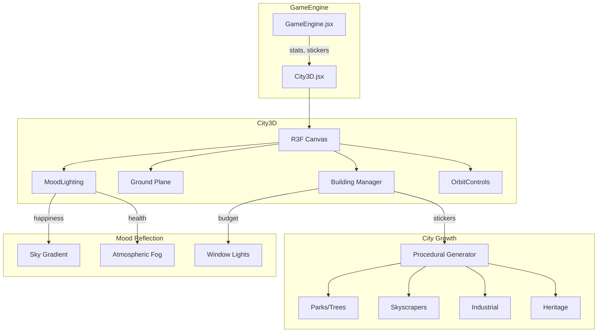

# 3D City Visualization Feature

Create an interactive 3D city that visually evolves as players approve cards, with the cityscape reflecting game statistics (Health, Happiness, Budget, Land) through atmospheric and structural changes.

---

## User Review Required

> [!IMPORTANT]
> **New Dependencies:** This feature requires installing `@react-three/fiber` and `@react-three/drei` (~1.5MB gzipped). This is a significant addition but necessary for 3D rendering.

> [!WARNING]
> **Performance Consideration:** 3D rendering on mobile devices may impact battery life. The implementation includes a quality toggle (low/high) to manage this.

> [!CAUTION]
> **Breaking Change to CityBackground:** The existing `CityBackground.jsx` will be replaced with a 3D version. The old 2D icon sticker system will be deprecated.

### Design Questions for Your Input
1. **City Theme**: Should the city be **stylized/low-poly** (faster, more game-like) or **realistic** (slower, more immersive)?
2. **Camera Control**: Auto-orbit only, or allow user drag-to-rotate?
3. **Building Types**: Should each card type generate a unique building model, or just height/color variations?

---

## Proposed Changes

### Dependencies

#### [MODIFY] [package.json](file:///c:/Users/Darius%20Koh/Documents/Y3S2/ProID/Prototype/package.json)
Add required 3D rendering libraries:
```diff
  "dependencies": {
+   "@react-three/fiber": "^9.1.0",
+   "@react-three/drei": "^10.0.0",
    "date-fns": "^4.1.0",
```

---

### 3D City Component

#### [NEW] [City3D.jsx](file:///c:/Users/Darius%20Koh/Documents/Y3S2/ProID/Prototype/src/components/City3D.jsx)
Main 3D city visualization component:
- **Canvas Setup**: React Three Fiber canvas with perspective camera
- **Lighting System**: Ambient + directional lights that shift color based on `happiness` stat
- **Ground Plane**: Reflective ground with grid texture
- **Building Manager**: Renders buildings based on `approvedStickers` array
- **Atmosphere**: Sky color gradient based on `health` stat

```jsx
// Core structure
<Canvas camera={{ position: [15, 15, 15] }}>
  <MoodLighting happiness={stats.happiness} health={stats.health} />
  <Ground landUsage={stats.land} />
  <Buildings stickers={approvedStickers} />
  <OrbitControls autoRotate enableZoom={false} />
</Canvas>
```

---

#### [NEW] [Building.jsx](file:///c:/Users/Darius%20Koh/Documents/Y3S2/ProID/Prototype/src/components/3d/Building.jsx)
Procedural building generator:
- **Building Types**: Map sticker names → building presets (height, width, color)
- **Spawn Animation**: Buildings grow from ground with spring animation
- **Window Lights**: Emissive materials that glow based on `budget` stat (rich city = more lights)

| Sticker Type | Building Appearance |
|--------------|-------------------|
| `park`, `tree`, `leaf` | Green space with trees |
| `building`, `skyscraper` | Tall glass tower |
| `factory` | Industrial block with smokestacks |
| `hospital` | White building with red cross |
| `heritage`, `bungalow` | Low-rise traditional style |

---

#### [NEW] [MoodLighting.jsx](file:///c:/Users/Darius%20Koh/Documents/Y3S2/ProID/Prototype/src/components/3d/MoodLighting.jsx)
Dynamic atmosphere system:
- **Happiness → Sky Color**: High happiness = bright sunset/gold, Low = grey/stormy
- **Health → Fog/Haze**: Low health = smog effect, High = clear atmosphere
- **Budget → Light Intensity**: Low budget = dim city, High = vibrant glow

---

### Integration

#### [MODIFY] [GameEngine.jsx](file:///c:/Users/Darius%20Koh/Documents/Y3S2/ProID/Prototype/src/components/GameEngine.jsx)
Replace existing `CityBackground` import with new `City3D` component:
```diff
-import CityBackground from './CityBackground';
+import City3D from './City3D';
```

Update render to pass full stats:
```diff
-{/* CityBackground Removed per user request */}
-{/* <CityBackground approvedStickers={approvedStickers} /> */}
+<City3D 
+  approvedStickers={approvedStickers}
+  stats={stats}
+  isPlaying={!crisisMode && !showAdvisor}
+/>
```

---

#### [DELETE] [CityBackground.jsx](file:///c:/Users/Darius%20Koh/Documents/Y3S2/ProID/Prototype/src/components/CityBackground.jsx)
This 2D icon-based component will be replaced by `City3D.jsx`. The file can be kept as backup initially.

---

## Architecture Diagram



---

## Verification Plan

### Manual Verification (Primary)

Since this is a visual 3D feature, manual testing is most appropriate:

1. **Install & Build Test**
   ```bash
   cd c:\Users\Darius Koh\Documents\Y3S2\ProID\Prototype
   npm install
   npm run dev
   ```
   - Verify no console errors on load
   - Confirm 3D canvas renders in game view

2. **City Evolution Test**
   - Start a new game
   - Swipe right on 3-4 cards
   - **Expected**: New buildings appear with animation each time
   - **Verify**: Buildings match card theme (e.g., park card → green space)

3. **Mood Reflection Test**
   | Action | Expected Visual |
   |--------|----------------|
   | High happiness (>70) | Warm golden sky, bright lights |
   | Low happiness (<40) | Grey/stormy sky, dim atmosphere |
   | High health (>70) | Clear air, green trees |
   | Low health (<40) | Hazy/smoggy atmosphere |
   | Low budget (<20) | Few lit windows, darker city |

4. **Crisis Mode Test**
   - Trigger a crisis event (occurs every 5 swipes)
   - **Expected**: 3D scene should dim or pause rotation during crisis modal

5. **Performance Check**
   - Open browser DevTools → Performance tab
   - Run game with 10+ buildings
   - **Target**: Maintain 30+ FPS on desktop, 20+ on mobile

### Optional: Integration Test
If time permits, add a simple test to verify the component mounts:
```javascript
// src/components/__tests__/City3D.test.jsx
import { render } from '@testing-library/react';
import City3D from '../City3D';

test('renders without crashing', () => {
  render(<City3D approvedStickers={[]} stats={{ budget: 50, land: 50, health: 50, happiness: 50 }} />);
});
```
Run with: `npm test` (if Jest is configured)

---

## Rollback Plan
If performance is unacceptable or issues arise:
1. Revert `GameEngine.jsx` changes
2. Re-enable commented `CityBackground` component
3. Consider implementing as optional "3D Mode" toggle instead
