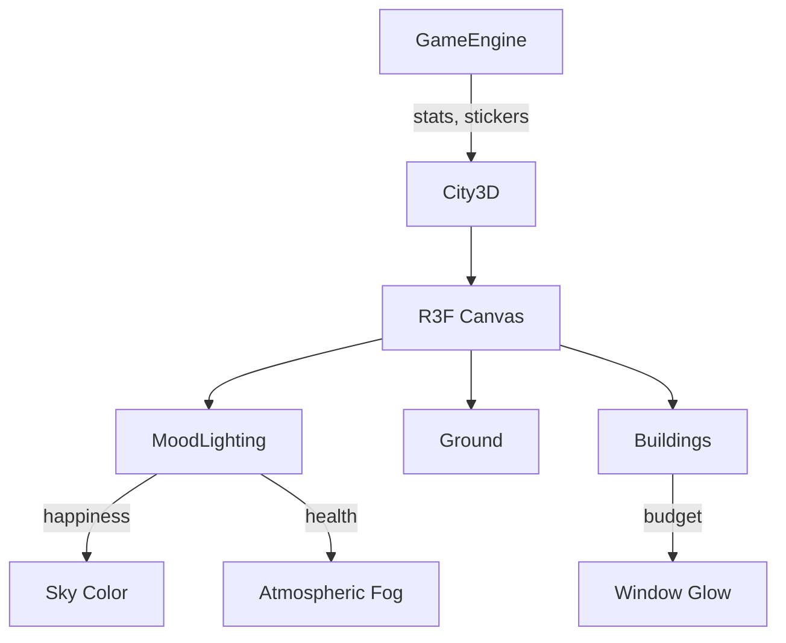

# 3D City Visualization - Walkthrough

Implementation of an interactive 3D city that evolves as players approve cards, with the atmosphere reflecting game statistics.

---

## Summary

| Aspect | Details |
|--------|---------|
| **Status** | ✅ Complete - Build Passing |
| **Dependencies Added** | `@react-three/fiber`, `@react-three/drei`, `three`, `@react-spring/three` |
| **Bundle Impact** | ~386KB gzipped (includes Three.js) |
| **Components Created** | 4 new files |

---

## Changes Made

### New Files

| File | Purpose |
|------|---------|
| [City3D.jsx](file:///c:/Users/Darius%20Koh/Documents/Y3S2/ProID/Prototype/src/components/City3D.jsx) | Main 3D canvas with camera, controls |
| [MoodLighting.jsx](file:///c:/Users/Darius%20Koh/Documents/Y3S2/ProID/Prototype/src/components/3d/MoodLighting.jsx) | Dynamic sky/fog based on happiness & health |
| [Buildings.jsx](file:///c:/Users/Darius%20Koh/Documents/Y3S2/ProID/Prototype/src/components/3d/Buildings.jsx) | Procedural building generator with 5 types |
| [Ground.jsx](file:///c:/Users/Darius%20Koh/Documents/Y3S2/ProID/Prototype/src/components/3d/Ground.jsx) | Ground plane with grid |

### Modified Files

render_diffs(file:///c:/Users/Darius%20Koh/Documents/Y3S2/ProID/Prototype/src/components/GameEngine.jsx)

---

## Architecture



---

## Mood Reflection System

| Stat | Visual Effect |
|------|---------------|
| **Happiness** | Sky color: warm golden (high) → grey-blue (low) |
| **Health** | Fog density: clear (high) → smoggy (low) |
| **Budget** | Building window glow intensity |
| **Land** | Ground plane color |

---

## Building Types

5 procedural building presets based on sticker type:

````carousel
**🌳 Park (Trees)**
Stickers: `park`, `tree`, `leaf`
- Green ground disc
- Brown trunk cylinder
- Green foliage sphere
<!-- slide -->
**🏢 Tower (Skyscrapers)**
Stickers: `building`, `skyscraper`, `mixed_use`
- Tall box geometry
- Glass-like metallic material
- Glowing windows (budget-based)
<!-- slide -->
**🏭 Industrial**
Stickers: `factory`, `drain`
- Blocky structure
- Smokestacks on roof
- Muted colors
<!-- slide -->
**🏛️ Heritage**
Stickers: `heritage`, `bungalow`, `shophouse`
- Low-rise structure
- Pointed roof (cone)
- Warm traditional colors
<!-- slide -->
**🛰️ Special/Tech**
Stickers: `island`, `satellite`, `wifi`
- Cylindrical tower
- Metallic finish
- Glowing antenna orb
````

---

## Verification

### Build Status
```
✓ 2982 modules transformed
✓ Built successfully in 11.58s
✓ Bundle: 386KB gzipped
```

### Manual Testing Checklist

- [ ] Start game → 3D city renders behind cards
- [ ] Approve 3 cards → Buildings appear with animation
- [ ] Low happiness → Sky turns grey/blue
- [ ] Low health → Fog/smog visible
- [ ] Crisis mode → Camera rotation pauses
- [ ] Mobile → Verify acceptable FPS (20+)

---

## Enhancements (Phase 2)

### View City Toggle Button
A new button in the top-left corner (moved to bottom-center) lets players hide the cards and view their city in full:
- Press "View City" → Cards/HUD fade, camera zooms in, rotation speeds up
- Press "Back to Cards" → Returns to normal gameplay view
- Allows zoom and rotation in showcase mode (inverted drag for natural feel)

### Clickable Buildings
In "View City" mode, buildings are clickable:
- Click a building → Info tooltip appears with:
    - Educational Description (e.g., function of a park or tech hub)
    - Building Type & Color Code
- Includes smooth fade-in/out animations

### Crisis Visual Effects
| Crisis Type | Visual Effects |
|-------------|---------------|
| **Flash Flood** (5 cards) | Rain particles, rising water level, stormy lighting |
| **Heat Wave** (10 cards) | Orange heat shimmer particles, ground glow, intense sun glare |

### Enhanced Building Models
10+ distinctive building types with unique shapes and details:
- **Towers**: Window bands on sides, rooftop details
- **Shophouses**: Lit storefronts, sloped roof overhangs
- **Tech Hubs**: Glowing rings, antenna orbs with point lights
- **Parks**: Multiple layered trees with cone foliage
- **Islands**: Beach ring, surrounding water effect
- **Industrial**: Smokestacks with orange glow lights

---

## Notes

> [!TIP]
> The 3D scene uses `pointerEvents: 'none'` so swipe gestures pass through to the cards.

> [!WARNING]
> Bundle size increased significantly (~386KB). Consider lazy loading City3D if startup time matters.
